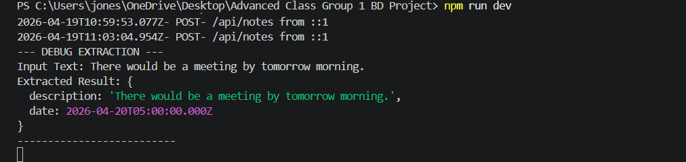
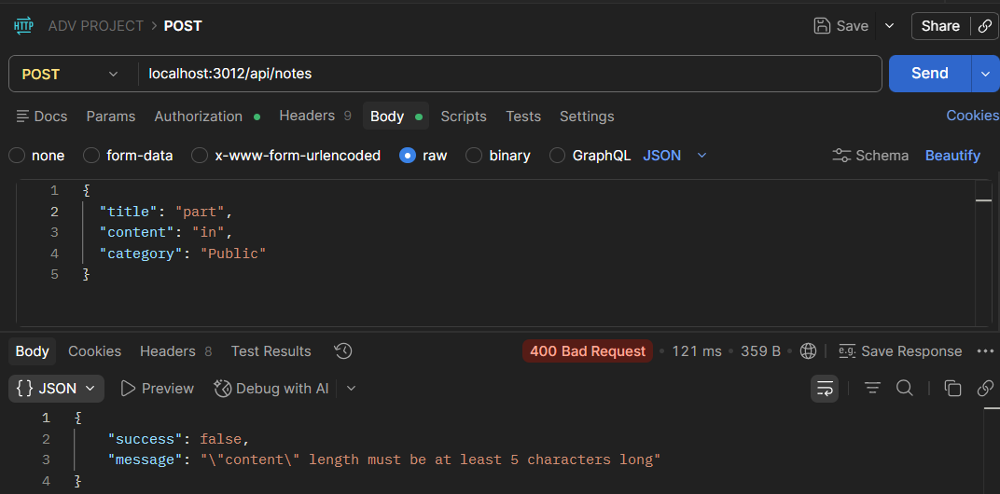
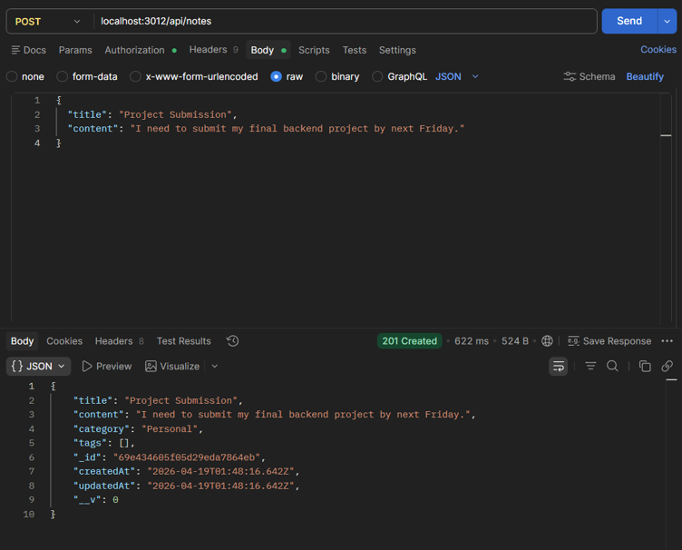
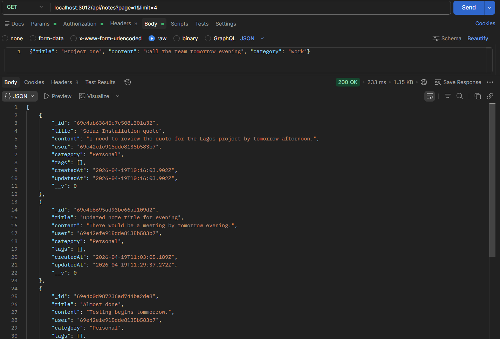
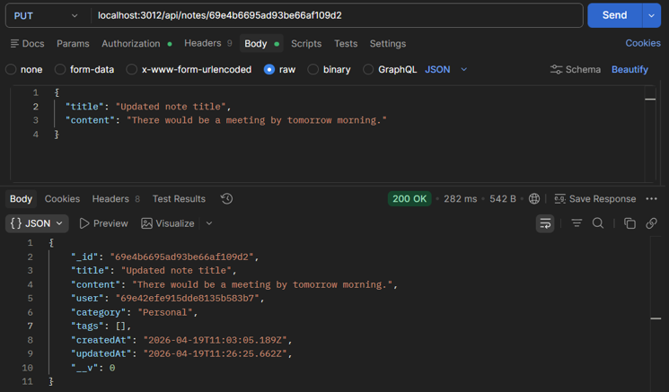

# BeTechified Advanced: Personal Knowledge Base API

A production-ready RESTful API built with Node.js, Express, and MongoDB, designed to function as a "Second Brain" for note-taking and knowledge organization.

Live URL: [https://your-app-name.onrender.com]

Status:  

---

## | Project Overview

This backend provides full CRUD functionality for a Notion-style application. It features advanced querying capabilities including text search across titles and content, category filtering, sorting, and pagination.

## | Tech Stack

- Runtime: Node.js
- Framework: Express.js
- Database: MongoDB Atlas (Mongoose ODM)
- Validation: Joi / Mongoose Validation
- Hosting: Render.com

---

## | Installation & Setup

1.  **Clone the repository:**

        git clone https://github.com/Neekbillzz/Notes-API-Group-1-BD.git

2.  **Install dependencies:**

        npm install

3.  **Configure Environment Variables (Create a .env file):**

        PORT=your_port_number

        MONGO_URI=your_mongodb_connection_string_here

        JWT_SECRET= your_string_secret

4.  **Start the server:**

        npm start

5.  **Endpoints**

All requests should be made to the following base URL:
https://your-app-name.onrender.com/api

### Notes Resource

| Method | Endpoint   | Description                                                                                 | Query Parameters / Body                  |
| :----- | :--------- | :------------------------------------------------------------------------------------------ | :--------------------------------------- |
| POST   | /notes     | Create a new note and Triggers automated task extraction if date/time keywords are detected | Body: { title, content, category, tags } |
| GET    | /notes     | Fetch all notes                                                                             | Query: page, limit, search, sort         |
| GET    | /notes/:id | Fetch a single note                                                                         | Params: id                               |
| PUT    | /notes/:id | Update an existing note                                                                     | Body: { title, content, category, tags } |
| DELETE | /notes/:id | Remove a note                                                                               | Params: id                               |

---

### Example Usage (Advanced Querying)

To search for notes about "Nodejs" in the "Backend" category, with pagination:

    GET /api/notes?search=nodejs&category=Backend&page=1&limit=5

---

## | Special Features: Automated Task Extraction

- **AI-Powered Task Extraction**

This API goes beyond basic note-taking by automatically identifying "action items" within your notes. When you save a note, the backend scans for temporal keywords to create separate, trackable tasks.

**How it Works**

1. Detection: The server parses note content for keywords like "tomorrow", "by 5pm", or "next Friday".

2. Parsing: It uses a regex-based extraction utility to separate the task description from the deadline.

3. Database Relation: A new document is automatically created in the Tasks collection with a reference link (ObjectId) back to the original note.

**Example Logic Flow**

  
_(Terminal Showing Debug Extraction)_

The image above shows the server successfully intercepting a note and logging the extracted task details to the console.

---

### | Validation

- **Validation:** Powered by **Joi**, ensuring data integrity with meaningful error messages for every request

  
_(Meaningful Error Messages)_

---

## | API Reference & Postman Documentation

### 1. Create a Note (POST)

POST /api/notes

  
_(Postman window showing a successful 201 Created response for a new note)_

---

### 2. Get All Notes (Advanced Querying)

GET /api/notes

Supports the following query parameters:

| Parameter | Description                 | Example            |
| :-------- | :-------------------------- | :----------------- |
| page      | Page number for pagination  | ?page=2            |
| limit     | Items per page              | ?limit=5           |
| search    | Text search (title/content) | search?query=javascript |
| sort      | Field to sort by            | ?sort=-createdAt   |

  
_(Postman showing Search/Filter results with multiple notes)_

  
_(Postman showing Pagination logic (e.g., page 1 of 2))_

---

### 3. Get Single Note (GET)

GET /api/notes/:id

### 4. Update Note (PUT)

PUT /api/notes/:id

  
_(Postman showing a 200 OK update of a note's title or content)_

### 5. Delete Note (DELETE)

DELETE /api/notes/:id

---

## | Data Model

The Note schema is designed for performance with text indexing for search functionality.

json
{

"title": "String (Required, Indexed)",

"content": "String (Required, Indexed)",

"category": "String (Optional)",

"tags": "Array of Strings",

"createdAt": "Timestamp",

"updatedAt": "Timestamp"

}

## | Error Handling

The API implements standard HTTP status codes:

- 200 / 201 : Success

- 400 : Bad Request (Validation Failures)

- 404 : Not Found

- 500 : Internal Server Error

## | The Team (Group 1)

- ABILI NICHOLAS - Database Architecture & Documentation

       https://github.com/Neekbillzz/Notes-API-Group-1-BD

- JERRY - Logic Lead

       https://github.com/Neekbillzz/Notes-API-Group-1-BD

- SMOKEY - Quality & Security

      https://github.com/Neekbillzz/Notes-API-Group-1-BD

- ELLA - DevOps

       https://github.com/Neekbillzz/Notes-API-Group-1-BD
